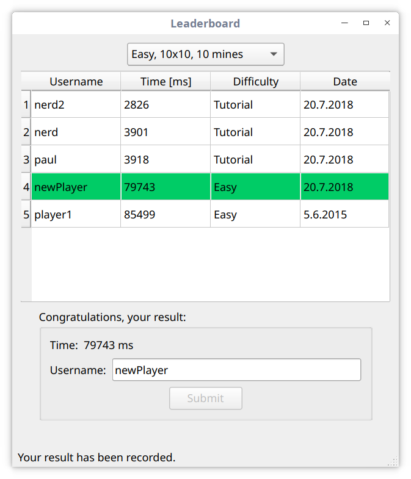

# Minesweeper
Minesweeper developed by Pavol Marak.

First working version. Some functionality is missing and will be added soon. Game now supports only 10x10 grid size. The game has been tested only on Manjaro Linux. On Windows, there problems with paths that prevent the app to function correctly. Stay tuned.

This is a screenshot of the leaderboard that appears after successfully completing the game. It allows you to save and compare your result with other players. 

